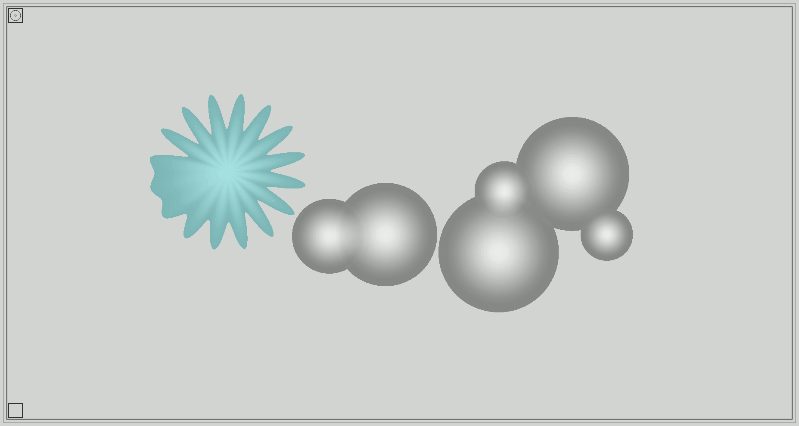

# [intervallo](https://allyoucanmap.github.io/intervallo/index.html)
**audio map**




[demo](https://allyoucanmap.github.io/intervallo/index.html) (desktop)

## how it works

edit mode:
- click on top left button to activate edit mode 
- click on the canvas to set the center of the circle + 
- move the mouse and click again to draw the circle ( --- + --- ) 
- drag an item from the list and drop it over a circle to assign the selected audio 
- drag and drop the `none` item to remove the assigned audio from a circle 
- edit the color audio by clicking on the black square near the item on the list &nbsp;&nbsp;
- exit from color picker by clicking on the background 
- click on the center of an existing circle to change its position ( &nbsp;&nbsp;&nbsp; &nbsp;&nbsp; + )
- click on the circumference of an existing circle to edit the radius (( &nbsp;&nbsp;&nbsp;&nbsp;&nbsp; + --- )) 
- drag with left button on a circle to delete it ( &nbsp;&nbsp;&nbsp; &nbsp;&nbsp; + )
- click on bottom left button to download the current map state (intervallo.json) 
- drag and drop a GeoJSON feature collection on the canvas to display geolocated geometries
- click on top left button to exit from edit mode 

navigate: 
- scroll the mouse wheel to zoom 
- drag the mouse wheel to pan 

read only mode:
- add a intervallo.json file in the root folder to visualize the audio map in read only mode

folders structure:
```
|__ /audio
|   |__ _config.json
|   |__ ... (audio files)
|
|__ /dist
|   |__ intervallo.js
|
|__ index.html
|

/* read only mode */

|__ intervallo.json
```

`_config.json` represents the starting data of the audio map

_config.json params:

- center, longitude and latitude positions in EPSG 4326
- zoom, value between 0 and 21
- audio, list of audio files to use in the editor, original files have to be located in the same folder of _config.json (./audio)

```
{
    "center": [
        9, // longitude
        45 // latitude
    ],
    "zoom": 5,
    "audio": [
        "sea.mp3",
        "car.mp3",
        ...
    ]
}
```

## development

`npm install`

`npm start`

url -> **http://localhost:3000/**

**build**

`npm run compile`

output -> **dist/intervallo.js**

---

node v9.2.1

npm v5.6.0

---
